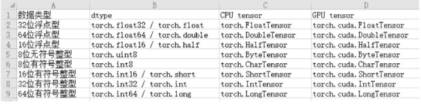

# 基本创建方式

1. 张量的数据类型

   在torch中CPU和GPU张量分别有8种数据类型

   张量中默认的数据类型是 float32(torch.FloatTensor)

   在torch中CPU和GPU张量分别有8种数据类型

2. torch.tensor(data=, dtype=) 根据指定数据创建张量

   ```python
   import torch # 需要安装 torch 模块
   import numpy as np
   
   
   def fn_01():
       # 1. 创建张量标量
       data = torch.tensor(10)
       print(data) # tensor(10)
   
       # 2. numpy 数组, 由于data为float64, 张量元素类型也是float64
       data = np.random.randn(2,3)
       data = torch.tensor(data)
       print(data)
       # tensor([[-0.0911,  0.1764, -1.1722],[-0.4504, -1.2094,  0.6546]], dtype=torch.float64)
   
       # 3. 列表, 浮点类型默认float32
       data = [[10., 20., 30.], [40., 50., 60.]]
       data = torch.tensor(data)
       print(data) # tensor([[10., 20., 30.],[40., 50., 60.]])
   
   if __name__ == '__main__':
       fn_01()
   
   ```

   